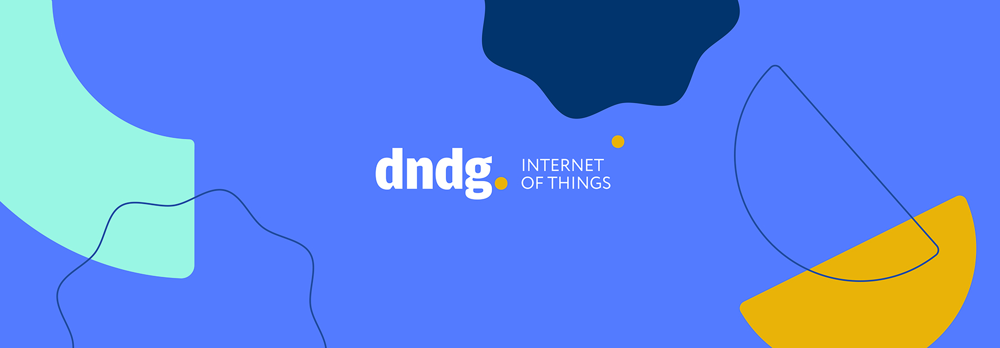

# Welcome to DNDG

Welcome to the introductory page of DNDG on GitHub! We are a software development company specialized in providing comprehensive IoT solutions. Our goal is to leverage cutting-edge technology to create innovative software solutions for the IoT industry.

## What We Do

At DNDG, we offer a wide range of services to meet the unique needs of our clients in the IoT domain. Our expertise includes:

- **Software Development**: We specialize in creating tailor-made software solutions that address the specific requirements of our clients. Our team of experienced developers excels in using open-source technologies to deliver robust, scalable, and cost-effective solutions.

- **End-to-End IoT Solutions**: We provide complete IoT solutions, from conceptualization and design to implementation and deployment. Our comprehensive approach covers hardware integration, cloud connectivity, data analytics, and user interfaces, ensuring seamless integration and efficient management of IoT ecosystems.

- **Open-source solutions**: We are experts in leveraging the power of open-source software. By harnessing the capabilities of open-source projects, we provide innovative and flexible solutions to our clients, ensuring transparency, interoperability, and community support.

## Get in Touch

If you have any questions, inquiries, or want to explore partnership opportunities, feel free to reach out to us. Our company is based in Turin, Italy, and you can contact us through the following channels:

- Website: [https://dndg.it](https://dndg.it)
- Email: iot@dndg.it

We look forward to hearing from you and discussing how we can collaborate.
